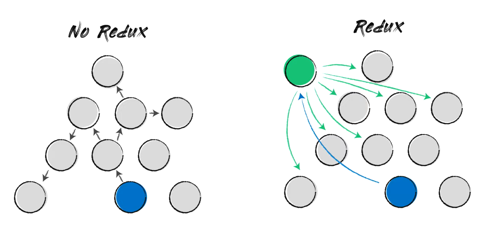
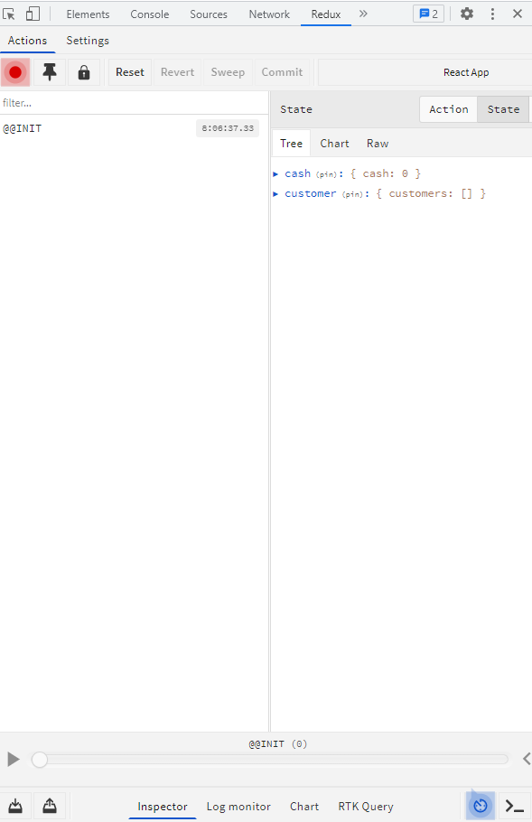

Redux app snippet.

Redux is a library for working with global state. Simply it is a data storage.

For what purpose we need redux? It solves a problem called props drilling. If we 
have big application, and we need to pass data from one child node to other we will just take the state up.
But, as I mentioned before, we have a big application, so we will have a lot of such kind of data in our
parent component. That how props drilling appears.



So, all of this data, that we have in our parent component, we move to the redux.

In redux, we have 4 main components:

1. State
2. Actions
3. Reducers
4. Dispatcher(dispatch)

State is a javascript object, that stores data. Only one source of true. Immutable(always returns new object).

Action is a javascript object with type of action and any payload. Defines how exactly we can mutate data.

Reducer is a function, that accepts state and action. By default, returns state. Pure functions.

Dispatcher or dispatch function accepts action and delivers this action to reducer.

Action &rarr; Dispatch &rarr; Reducer &rarr; State

To connect our React with Redux we need to add a Provider and pass there a store, created with
createStore function.

Create reducers:
```typescript jsx
// ~/src/store/cashReducer
const defaultState = {
    cash: 0,
}

const ADD_CASH = "ADD_CASH"
const GET_CASH = "GET_CASH"

export const cashReducer = (state = defaultState, action) => {
    switch (action.type) {
        case "ADD_CASH":
            return {...state, cash: action.payload + state.cash}
        case "GET_CASH":
            return {...state, cash: state.cash - action.payload}
        default:
            return state;
    }
}

export const addCashAction = (payload) => ({type: ADD_CASH, payload})
export const getCashAction = (payload) => ({type: GET_CASH, payload})
```

```typescript jsx
// ~/src/store/customerReducer
const defaultState = {
    customers: []
}

const ADD_CUSTOMER = "ADD_CUSTOMER"
const REMOVE_CUSTOMER = "REMOVE_CUSTOMER"

export const customerReducer = (state = defaultState, action) => {
    switch (action.type) {
        case ADD_CUSTOMER:
            return {...state, customers: [...state.customers, action.payload]}
        case REMOVE_CUSTOMER:
            return {...state, customers: state.customers.filter((customer)=>customer.id!==action.payload)}
        default:
            return state;
    }
}

export const addCustomerAction = (payload) => ({type: ADD_CUSTOMER, payload})
export const removeCustomerAction = (payload) => ({type: REMOVE_CUSTOMER, payload})
```
In reducers it is advised to create action variables and action creator functions.


Create actions:
```typescript jsx
import {createStore} from "redux";
import {reducer} from './reducers'

const store = createStore(reducer)
```

Create store:
```typescript jsx
// ~/src/store/index
import {legacy_createStore, combineReducers} from "redux";
import {cashReducer} from "./cashReducer";
import {customerReducer} from "./customerReducer";

const rootReducer = combineReducers({
    cash: cashReducer,
    customer: customerReducer
})

export const store = legacy_createStore(rootReducer)
```

Wrap our app with Provider:
```typescript jsx
// ~/src/index
import {Provider} from "react-redux";
import {store} from "./store";

const root = ReactDOM.createRoot(
    document.getElementById('root') as HTMLElement
);
root.render(
    <Provider store={store}>
        <App />
    </Provider>
);
```

If you want to use devtools, install redux-devtools extension in chrome 
and run this script to install devtools:
```bash
  $ npm i redux-devtools-extension
```

and then format your store initialization: 
```typescript jsx
// ~/src/store/index
import {composeWithDevTools} from "redux-devtools-extension";

export const store = legacy_createStore(rootReducer, composeWithDevTools())
```

Open your browser and move to devtools, then open tab calls redux:



To work with async code in redux we can use redux-thunk or redux-saga middleware.

Lets start from thunk. Install redux-thunk with:
```bash
  $ npm i redux-thunk
```

Move to our index file and update our store creation function. To connect middleware
in redux you can use applyMiddleware function:
```typescript jsx
// ~/src/store/index
import thunk from "redux-thunk";
import {applyMiddleware} from "redux";

export const store = legacy_createStore(rootReducer, composeWithDevTools(applyMiddleware(thunk)))
```

In our store folder we created asyncActions folder to store async action. Create a 
customers file:
```typescript jsx
// ~/src/store/asyncAction/customers
import {addManyCustomerAction} from "../customerReducer";

export const fetchCustomers = () => {
    return dispatch => {
        fetch('https://jsonplaceholder.typicode.com/users')
            .then(response => response.json())
            .then(json => dispatch(addManyCustomerAction(json)))
    }
}
```

Update customerReducer:
```typescript jsx
// ~/src/store/customerReducer
const defaultState = {
    customers: []
}

const ADD_CUSTOMER = "ADD_CUSTOMER"
const REMOVE_CUSTOMER = "REMOVE_CUSTOMER"
const ADD_MANY_CUSTOMERS = "ADD_MANY_CUSTOMERS"

export const customerReducer = (state = defaultState, action) => {
    switch (action.type) {
        case ADD_MANY_CUSTOMERS:
            return {...state, customers: [...state.customers, ...action.payload]}
        case ADD_CUSTOMER:
            return {...state, customers: [...state.customers, action.payload]}
        case REMOVE_CUSTOMER:
            return {...state, customers: state.customers.filter((customer)=>customer.id!==action.payload)}
        default:
            return state;
    }
}

export const addCustomerAction = (payload) => ({type: ADD_CUSTOMER, payload})
export const addManyCustomerAction = (payload) => ({type: ADD_MANY_CUSTOMERS, payload})
export const removeCustomerAction = (payload) => ({type: REMOVE_CUSTOMER, payload})
```

Here we created action and action creator for async code.